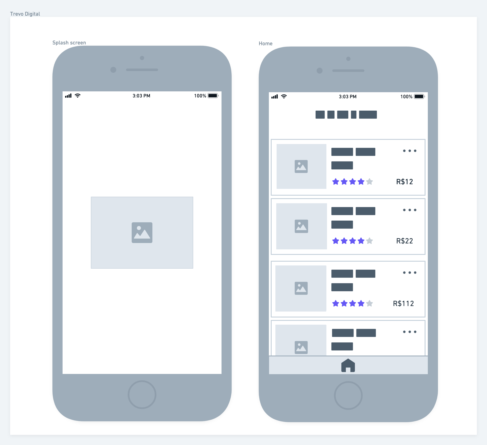

# Design Challenge 20210201

## Introduction

This is a challenge to test your knowledge of Design and Prototyping;

In this challenge, there are several ways to develop and obtain the proposed results. The objective is to evaluate its form of structuring and autonomy in decisions to build something scalable.

## Challenge / Case

The company Trevo Digital works with several customers globally in more than 15 countries, one of the main characteristics of the company is the strong positioning in the digital sector with a team focused on generating quality leads.
Therefore, all projects must be very well structured with SEO, fluidity and reuse in mind (components reused in several projects).
Its goal is to create a project that gives attention to the requirements mentioned above.

## Resources

1. Use some online collaboration design tool. Ex: Figma

## Step by step

In this challenge, we worked on the elaboration of an initial structure of the Design System and the development of two mobile and web prototypes of the screens of the e-commerce project of a new Trevo Digital Client.

Before starting work, the requirements and analysis team developed the initial WireFrame for the mobile version of the project:

To work on the prototype, we must follow the color palette that the client sent:

### Design System

The Design System for the project will be an initial draft with:

- Font Types
- Colors
- Components

### Mobile Version

To develop Mobile screens, we must review whether the UI and UX are correct before working on the prototype. With your knowledge, review the proposal and apply the necessary corrections that you consider necessary to improve the usability of the project.

### Desktop Version

No Wireframe proposal was developed for the desktop version, so we should elaborate it following the structure of the mobile version, but applying the necessary adjustments for the new version.

Some important elements that we have in the mobile version:

- Product image
- Title
- Valuation
- Price
- More options button

> Tip: A difference between the versions would be the pagination.

### Extras

- ** Differential 1 ** Create the visual single product proposal
- ** Differential 2 ** Prototyping the Valuation Modal in the Desktop version

## Repository Readme

- Must contain the title of the project
- A description of a sentence
- General instructions and final project files
- Captures of the final result of the Project
- Link to access the project if an Online system has been used.
- Don't forget [.gitignore](https://www.toptal.com/developers/gitignore)

## Last Step

Warn about the finalization and send for correction at: [https://coodesh.com/review-challenge](https://coodesh.com/review-challenge)
After this stage, the presentation / correction of the project will be scheduled.

## Instructions for Presentation:

1. It will be necessary to share the screen during the video call;
2. Leave all solution projects previously open on your computer before starting the call;
3. Leave the environments configured and ready to run;
4. Prepare yourself because you will be asked about each step and decision of the Challenge;
5. Prepare a list of questions, doubts, suggestions for improvements and feedbacks (if you have one).

## Support

Use our slack channel: http://bit.ly/32CuOMy to ask questions about the process or send an email to contato@coodesh.com.
